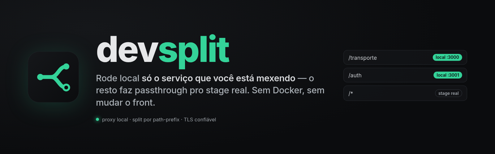
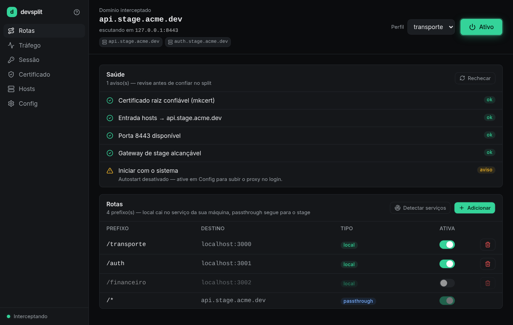
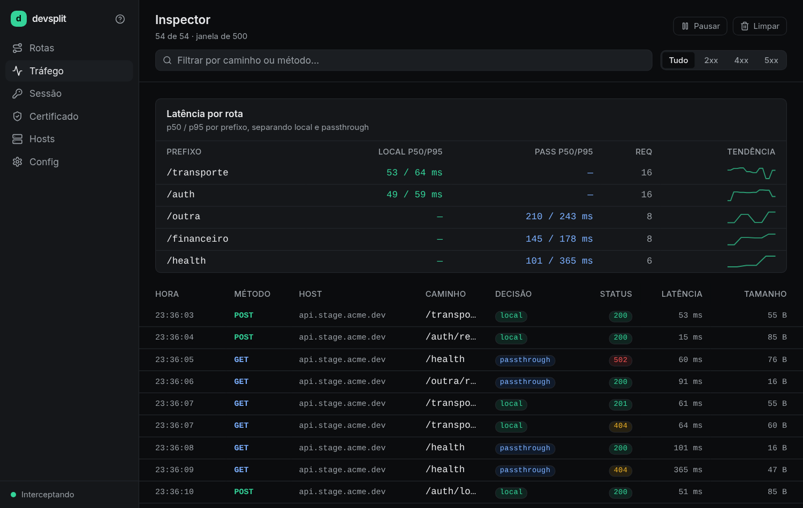
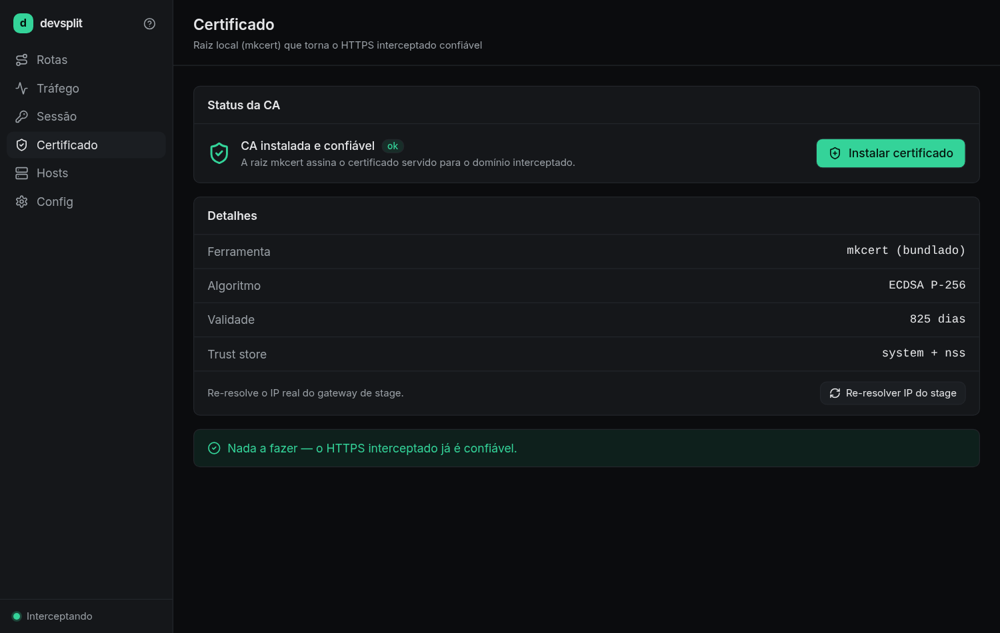

<div align="center">



<br />

# devsplit · landing page

**Site de apresentação do [devsplit](https://github.com/Matheuscara/devsplit)** — o proxy de
desenvolvimento que **divide o tráfego do seu gateway de stage**: você roda local só o serviço
que está mexendo, o resto faz `passthrough` pro ambiente real. _Sem Docker, sem subir a stack
inteira, sem mexer no front._

Página **estática** (HTML · CSS · JS puro, **sem build**), com hero em shader, diagrama de fluxo
animado e deploy nginx pronto pro Dokploy.

<br />


[**Projeto principal →**](https://github.com/Matheuscara/devsplit) · [Como rodar](#-rodar-local) · [Deploy](./DEPLOY.md) · [Changelog](./CHANGELOG.md)

</div>

---

## ✨ Destaques

- **Visual autoral** dark / neon verde / futurista — a metáfora do *split* (LOCAL × PASSTHROUGH) como eixo de design.
- **Hero em shader** `GrainGradient` (`@paper-design/shaders-react` via `esm.sh`), com **fallback CSS** se o CDN cair.
- **Diagrama de fluxo em SVG** com packets animados percorrendo os caminhos `local` e `passthrough`.
- **FX de cursor** em canvas (rastro + anel sobre clicáveis) e **packets de request** voando no hero.
- **Acessível e responsivo**: respeita `prefers-reduced-motion`, menu mobile com ARIA, contraste AA, anti-CLS.
- **Zero build**: editou? é só servir / re-deployar.

## 🖼️ Telas

| Rotas | Tráfego | Certificado |
|:---:|:---:|:---:|
|  |  |  |

## 🚀 Rodar local

```bash
# servidor estático simples
python3 -m http.server 8080            # → http://localhost:8080

# ou via Docker (igual ao deploy)
docker build -t devsplit-front .
docker run --rm -p 8080:80 devsplit-front   # → http://localhost:8080
```

## 📦 Deploy

nginx estático em Docker, pronto pro **Dokploy** (Traefik + TLS automático). Sem build step — o
nginx só serve os arquivos. Passo a passo em [`DEPLOY.md`](./DEPLOY.md).

## 🧱 Estrutura

```
index.html · styles.css · main.js              # o site (sem build)
assets/                                        # logo, banner, capturas de tela
Dockerfile · nginx.conf · docker-compose.yml   # deploy nginx
DEPLOY.md                                       # passo a passo de deploy
CHANGELOG.md                                    # histórico do que foi construído
```

### `main.js` — módulos

| Módulo | O que faz |
|---|---|
| **nav** | Estado `scrolled` ao rolar; menu mobile (hambúrguer + drawer, `Escape`, scroll lock). |
| **smooth scroll** | Âncoras com offset de 72px pro nav fixo. |
| **reveal** | `IntersectionObserver` em `[data-reveal]` com stagger por irmão. |
| **terminal** | Efeito de digitação disparado na viewport (instantâneo em reduced-motion). |
| **shader** | `GrainGradient` via `esm.sh`, com fallback CSS. |
| **FX de cursor** | Rastro em canvas + bolinha-ponteiro que vira anel sobre clicáveis. |
| **packets** | Chips de request animados no hero. |

> Toda animação tem caminho `prefers-reduced-motion`; o FX de cursor só roda em ponteiro fino.

## 📚 Documentação

Histórico completo do que foi construído (conceito, seções, design system, microinterações,
acessibilidade) em [`CHANGELOG.md`](./CHANGELOG.md).

## 📄 Licença

[MIT](./LICENSE) © [Matheus](https://github.com/Matheuscara)
